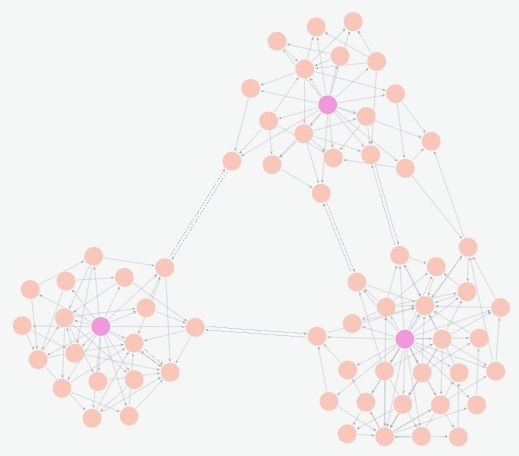
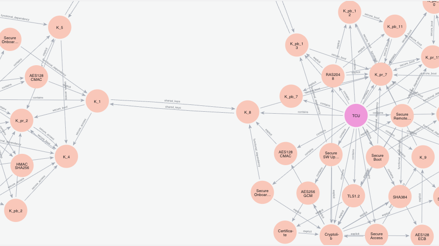
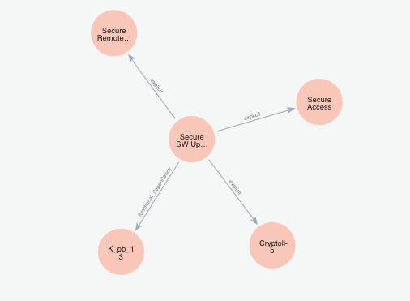
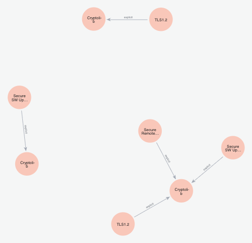
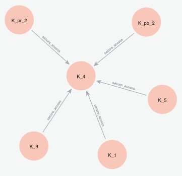
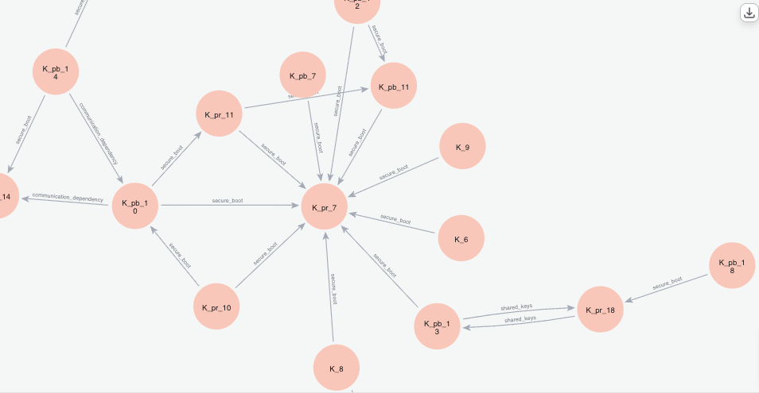
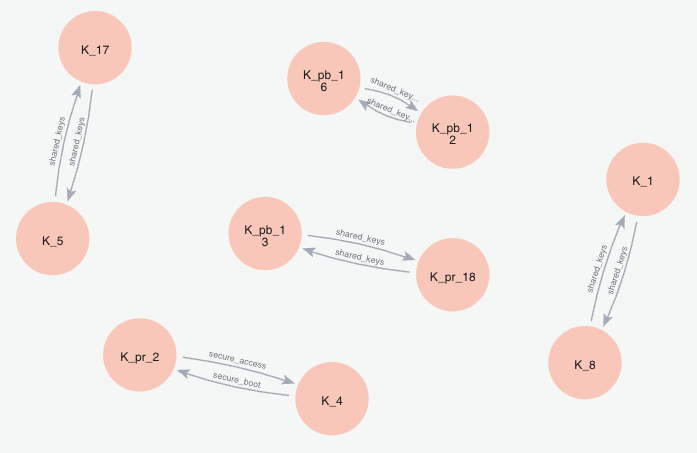
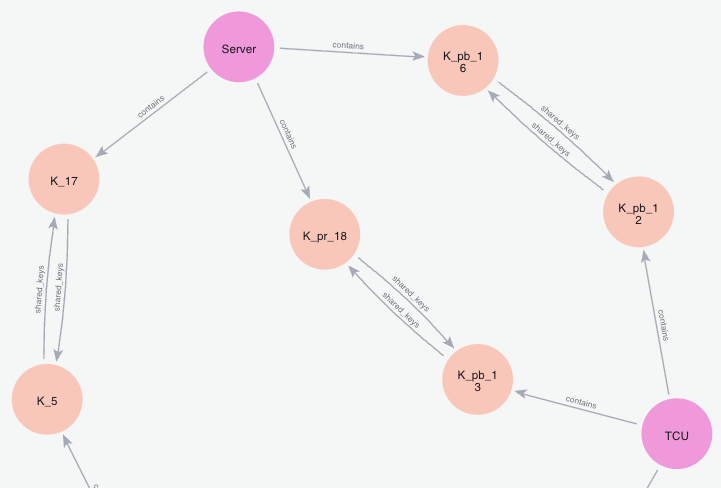
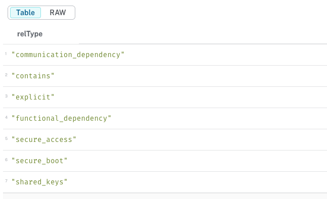

# Cryptographic Migration with Implicit Dependencies: Application Example (Asset)

This repository provides a machine-readable representation of the cryptographic
dependencies in a simplified but realistic automotive scenario, namely the
dependencies between the system and software components of an exemplary
in-vehicle architecture. The representation is encoded as a
[Cypher](https://neo4j.com/docs/cypher-manual/current/) script
([`cypher/setup_graph_db.cypher`](./cypher/setup_graph_db.cypher)) and captures
both the topological dependencies between components and additional non-obvious
or implicit dependencies. The accompanying example queries
([`cypher/queries.cypher`](./cypher/queries.cypher)) serve as a starting point
for further exploration of the application example and of the method described
in the underlying paper.# Machine-Readable Representation of an Application Example

This repository provides a machine-readable representation of the cryptographic
dependencies in a simplified but realistic automotive scenario, namely the
dependencies between the system and software components of an exemplary
in-vehicle architecture. The representation is encoded as a
[Cypher](https://neo4j.com/docs/cypher-manual/current/) script
([`cypher/setup_graph_db.cypher`](./cypher/setup_graph_db.cypher)) and captures
both the topological dependencies between components and additional non-obvious
or implicit dependencies. The accompanying example queries
([`cypher/queries.cypher`](./cypher/queries.cypher)) serve as a starting point
for further exploration of the application example and of the method described
in the underlying paper.

The Cypher scripts in the [`cypher/`](./cypher) folder can be used with any
graph database that supports Cypher; they have been developed and tested with
Neo4j [[1]](#references).

The file [`cypher/setup_graph_db.cypher`](./cypher/setup_graph_db.cypher)
contains the complete set of `CREATE` statements required to instantiate the
graph. Executing the script yields a database state that matches the
application example described in the underlying paper. The script has been
imported into and tested with
[Neo4j version 2025.10.1](https://neo4j.com/release-notes/database/neo4j-2025-10-1/).

## Repository Structure

```
.
├── cypher/
│   ├── setup_graph_db.cypher   # CREATE statements to instantiate the graph
│   └── queries.cypher          # Example queries presented below
├── pics/                       # Screenshots referenced in this README
└── README.md
```

## Neo4j Installation and Data Import

This section briefly outlines the steps required to load the example graph into
a Neo4j database. For more details and alternative installation options, please
consult the official [Neo4j documentation](https://neo4j.com/docs/).

1. The easiest installation and usage option is to install *Neo4j Desktop*.
   Follow the installation instructions at
   <https://neo4j.com/docs/desktop/current/installation/>.
2. Open Neo4j Desktop and create a new local database instance. This step
   requires providing a database name (e.g. `pqc_mig`), a username
   (default: `neo4j`) and a corresponding password.
3. Start the database instance by clicking the play button.
4. Connect to the database instance by clicking the *Connect* pull-down menu
   and selecting *query*.
5. Paste the contents of [`cypher/setup_graph_db.cypher`](./cypher/setup_graph_db.cypher)
   into the query field and click the play button next to the query field
   (`neo4j$`).
6. This should result in the message
   *"Created 65 nodes, created 190 relationships, set 65 properties, added 65 labels"*.

After successful execution, the database contains the full application example
as used in the underlying paper.

## APOC Installation

Some of the queries below require the Neo4j APOC library. Follow the
instructions at <https://neo4j.com/docs/apoc/current/installation/> to install
it and restart the database instance afterwards.

## Example Queries

This section presents a set of example Cypher queries that can be executed on
the imported graph. These queries illustrate how the dataset can be explored,
how the structural properties described in the underlying paper can be
inspected, and how the example can serve as a basis for further experiments.
For ease of use (e.g., copy-and-paste into the Neo4j Browser), all example
queries are also provided in the accompanying file
[`cypher/queries.cypher`](./cypher/queries.cypher).

The queries can be pasted into the query field and executed by clicking the
play button next to the query field. The corresponding result is displayed
below the query field. The result is shown as a graph if the *Graph* option is
enabled at the top of the display pane.

### Display All Nodes and Edges

The following query displays all contents (nodes and edges) of the database
(see figures below).

```cypher
MATCH (n)-[r]-(m)
RETURN n, r, m;
```





### Display All Direct Connections to One Node

The following query displays all connections (incoming and outgoing) of one
specific node. The component and node of interest can be selected via
`c.name` and `n.name`. Clicking on one of the displayed neighbouring nodes in
the Neo4j Browser expands the graph further.

```cypher
MATCH (c:Container)-[:contains]-(n:Node)
WHERE c.name = 'TCU'
  AND n.name = 'Secure SW Update'
MATCH (n:Node)-[r]-(m:Node)
RETURN n, r, m;
```



### Display Redundant Explicit Dependencies

The following query displays redundant explicit dependencies, i.e.
dependencies that can be removed by further transitive reduction of the graph.

```cypher
MATCH (n:Node)-[r:explicit]->(m:Node)
WHERE EXISTS {
  MATCH path = (n)-[:explicit*2..]->(m)
  WHERE NONE(rel IN relationships(path) WHERE rel = r)
}
RETURN n, r, m;
```



### Display Implicit Dependencies

The first query below displays all implicit dependencies that are based on a
secure-access dependency. The second query displays all implicit dependencies.

```cypher
// Implicit dependencies based on secure access dependencies
MATCH (n:Node)-[r:secure_access]->(m:Node)
WHERE NOT EXISTS {
  MATCH (n:Node)-[:explicit*1..]->(m:Node)
}
RETURN n, r, m;
```



```cypher
// All implicit dependencies
MATCH (n:Node)-[r:shared_keys|secure_boot|secure_access|communication_dependency|functional_dependency]->(m:Node)
WHERE NOT EXISTS {
  MATCH (n:Node)-[:explicit*1..]->(m:Node)
}
RETURN n, r, m;
```



### Display Cycles

> **Note:** The following queries require the APOC library.

The first query displays all cycles in the graph. The second query displays
all cycles together with the components (ECU, TCU, Server) that contain the
nodes participating in the cycles.

```cypher
// All cycles
MATCH (n:Node)
WITH collect(n) AS nodes
CALL apoc.nodes.cycles(nodes)
YIELD path
RETURN path;
```



```cypher
// All cycles together with their containing components
MATCH (n:Node)
WITH collect(n) AS nodes
CALL apoc.nodes.cycles(nodes)
YIELD path
WITH path, nodes(path) AS cycleNodes
MATCH (m:Node)-[r]-(c:Container)
WHERE m IN cycleNodes
RETURN path, m, r, c;
```



### Display All Edge Types

The following query displays all edge types present in the database.

```cypher
MATCH ()-[r]->()
RETURN DISTINCT type(r) AS relType
ORDER BY relType;
```



### Clear the Database

The following query permanently deletes all contents of the database.

```cypher
MATCH (n)
DETACH DELETE n;
```

## References

[1] Miller, J. J. (2013). *Graph Database Applications and Concepts with
Neo4j*. In: Proceedings of the Southern Association for Information Systems
Conference (SAIS 2013), Atlanta, GA, USA, March 23–24, 2013.
Available at: <https://aisel.aisnet.org/sais2013/24/>
